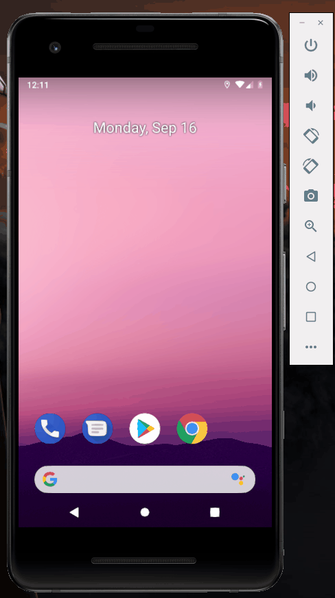

# <Dice Roller>

An Android application that simulates a dice roll.

Submitted by: Richard Salvaty

Time spent: 4 Hours

## User Stories

The following **required** functionality is complete:

* [X] Implemented LinearLayout view group.
* [X] Added interactive button.
* [X] Optimize app by using lateinit to search view hierarchy only once.
* [X] User can press button to simulate a die roll.

The following **additional** features are implemented:

* [X] Added more aesthetically pleasing dice

## Video Walkthrough 

Here's a walkthrough of implemented user stories:

## Notes

The only challenge I faced was getting a handle on the Kotlin language. I had also planned on adding a spot 
to show the previous roll results, but I just couldn't get it to work for me so it was excluded fr now.

## License

Copyright 2019 Richard Salvaty

Licensed under the Apache License, Version 2.0 (the "License");
you may not use this file except in compliance with the License.
You may obtain a copy of the License at

http://www.apache.org/licenses/LICENSE-2.0

Unless required by applicable law or agreed to in writing, software
distributed under the License is distributed on an "AS IS" BASIS,
WITHOUT WARRANTIES OR CONDITIONS OF ANY KIND, either express or implied.
See the License for the specific language governing permissions and
limitations under the License.
